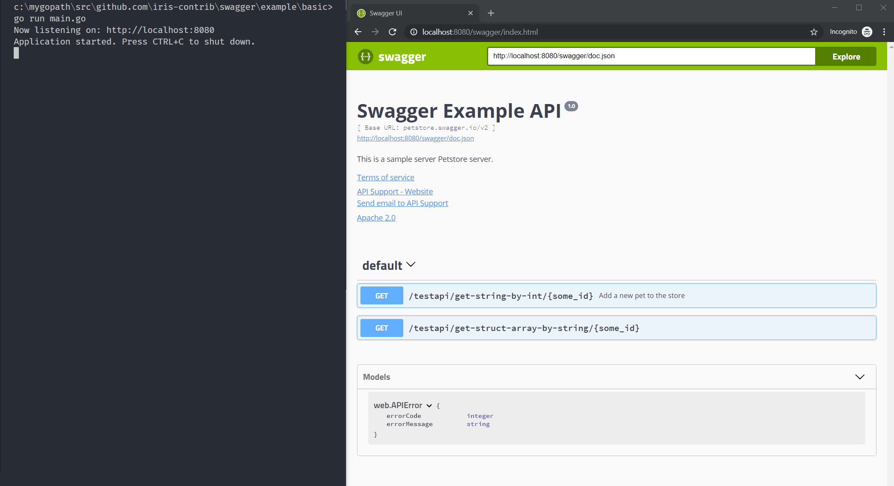

# Swagger for the Iris web framework

[Iris](https://github.com/kataras/iris) middleware to automatically generate RESTful API documentation with Swagger 2.0. Based on the [gin-swagger](https://github.com/swaggo/gin-swagger) as requested at [#1231](https://github.com/kataras/iris/issues/1231).

[](https://travis-ci.org/iris-contrib/swagger)
[](https://codecov.io/gh/iris-contrib/swagger)
[](https://goreportcard.com/report/github.com/iris-contrib/swagger)
[](https://godoc.org/github.com/iris-contrib/swagger)
[](https://app.fossa.io/projects/git%2Bgithub.com%2Firis-contrib%2Fswagger?ref=badge_shield)

## Usage

### Start using it
1. Add comments to your API source code, [See Declarative Comments Format](https://swaggo.github.io/swaggo.io/declarative_comments_format/).
2. Download [Swag](https://github.com/swaggo/swag) for Go by using:

```sh
$ go get -u github.com/swaggo/swag/cmd/swag
```

3. Run the [Swag](https://github.com/swaggo/swag) in your Go project root folder which contains `main.go` file, [Swag](https://github.com/swaggo/swag) will parse comments and generate required files(`docs` folder and `docs/doc.go`).

```sh
$ swag init
```

4. Download [swagger for Iris](https://github.com/iris-contrib/swagger) by using:

```sh
$ go get github.com/iris-contrib/swagger/v12@latest
```

And import following in your code:

```go
import "github.com/iris-contrib/swagger/v12" // swagger middleware for Iris 
import "github.com/iris-contrib/swagger/v12/swaggerFiles" // swagger embed files

```

### Canonical example:

```go
package main

import (
    "github.com/kataras/iris/v12"

    "github.com/iris-contrib/swagger/v12"
    "github.com/iris-contrib/swagger/v12/swaggerFiles"

    _ "./docs" // docs is generated by Swag CLI, you have to import it.
)

// @title Swagger Example API
// @version 1.0
// @description This is a sample server Petstore server.
// @termsOfService http://swagger.io/terms/

// @contact.name API Support
// @contact.url http://www.swagger.io/support
// @contact.email support@swagger.io

// @license.name Apache 2.0
// @license.url http://www.apache.org/licenses/LICENSE-2.0.html

// @host petstore.swagger.io
// @BasePath /v2
func main() {
    app := iris.New()

    config := &swagger.Config{
        URL: "http://localhost:8080/swagger/doc.json", //The url pointing to API definition
    }
    // use swagger middleware to 
    app.Get("/swagger/{any:path}", swagger.CustomWrapHandler(config, swaggerFiles.Handler))

    app.Run(iris.Addr(":8080"))
}
```

5. Run it, and browser to http://localhost:8080/swagger/index.html, you can see Swagger 2.0 Api documents.



6. If you want to disable swagger when some environment variable is set, use `DisablingWrapHandler`

### Example with disabling:

```go
package main

import (
    "github.com/kataras/iris/v12"

    "github.com/iris-contrib/swagger/v12"
    "github.com/iris-contrib/swagger/v12/swaggerFiles"

    _ "./docs" // docs is generated by Swag CLI, you have to import it.
)

// @title Swagger Example API
// @version 1.0
// @description This is a sample server Petstore server.
// @termsOfService http://swagger.io/terms/

// @contact.name API Support
// @contact.url http://www.swagger.io/support
// @contact.email support@swagger.io

// @license.name Apache 2.0
// @license.url http://www.apache.org/licenses/LICENSE-2.0.html

// @host petstore.swagger.io
// @BasePath /v2
func main() {
    app := iris.New()

    // use swagger middleware to 
    app.Get("/swagger/{any:path}", swagger.DisablingWrapHandler(swaggerFiles.Handler, "NAME_OF_ENV_VARIABLE"))

    app.Run(iris.Addr(":8080"))
}
```

Then, if you set envioment variable `NAME_OF_ENV_VARIABLE` to anything, `/swagger/*any`
will respond 404, just like when route unspecified.
